# Image Overview

## Desktop Images

### Camera Display
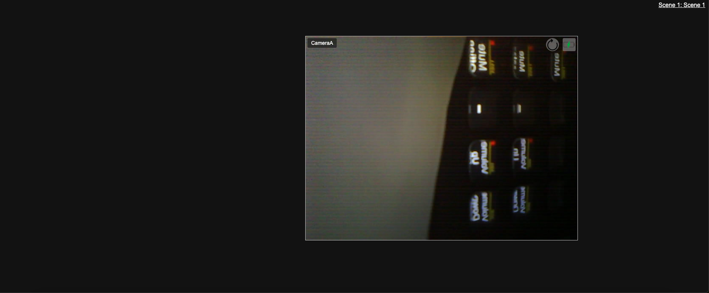

### Camera Display - Fill Out Field Warning
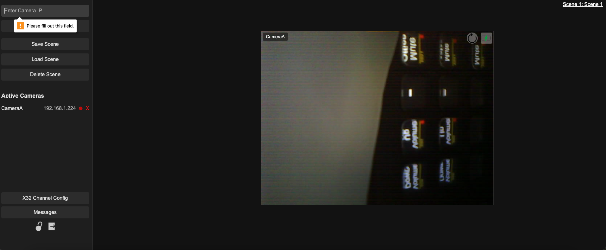

### Camera Display - Scene Picker
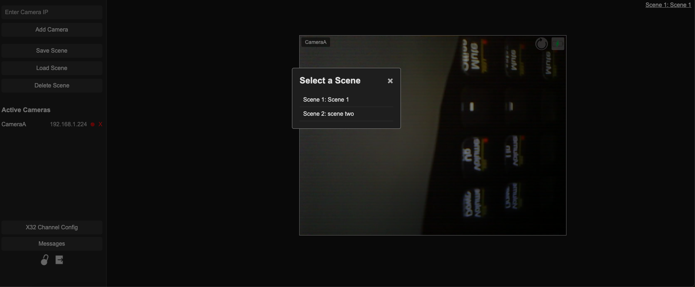

### Camera Display - Locked Sidebar
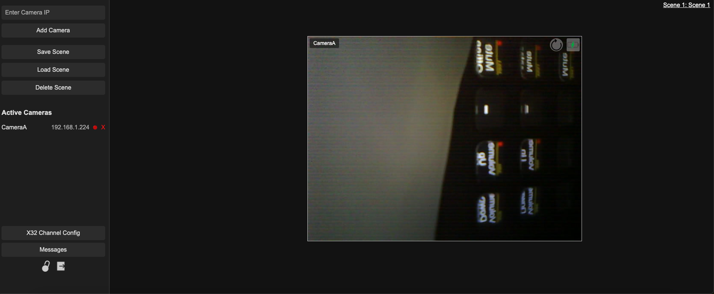

## Messages

### Messages
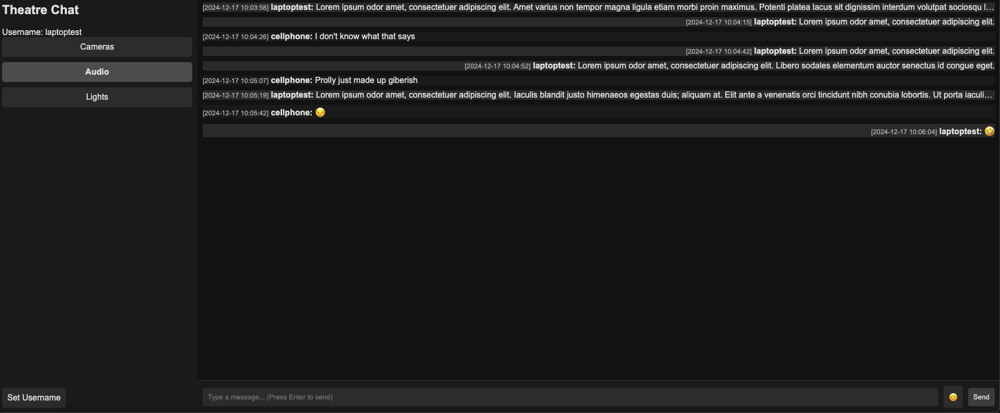

### Change Username
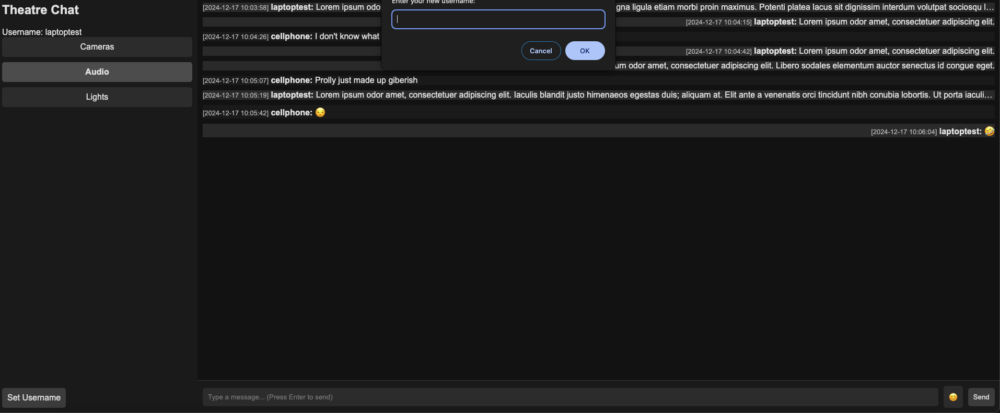

### Emoji Picker
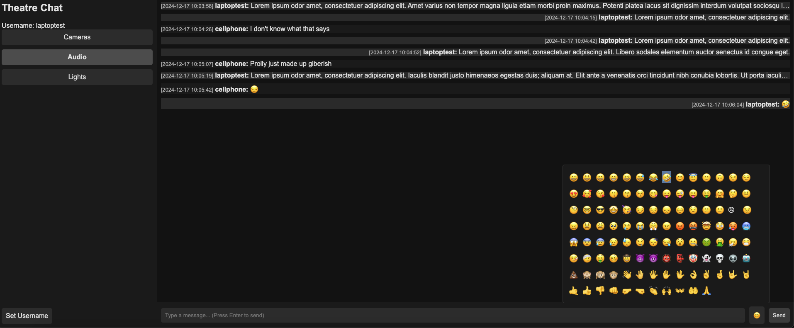

### Overflow Menu
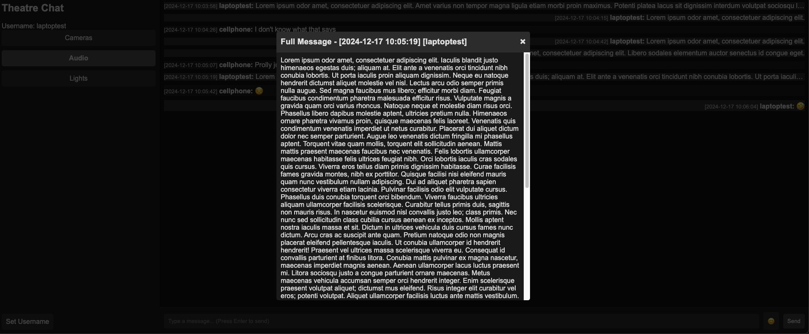

## X32 Channel Configurations

### Channel Configuration 1
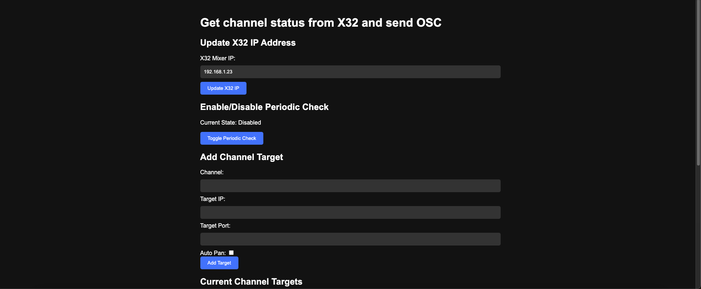

### Channel Configuration 2
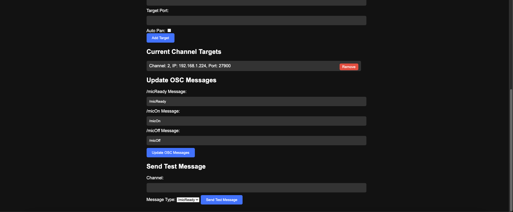

## Login Screen
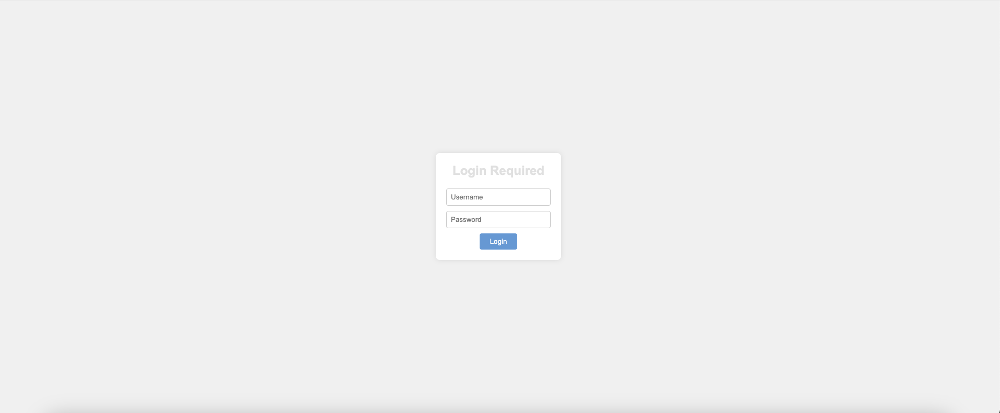

---

## Mobile Images

### Messages
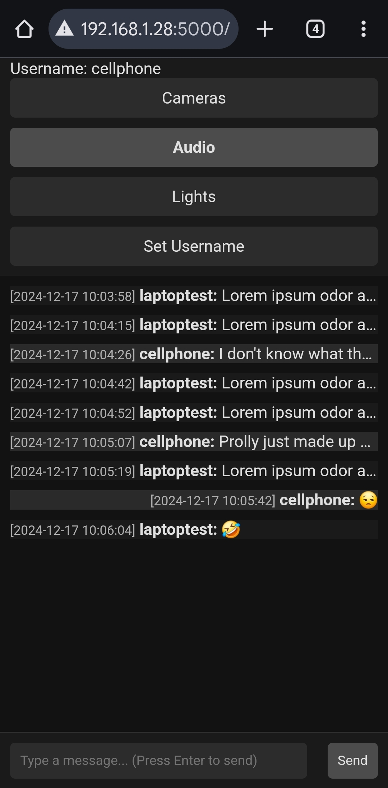

### Change Username
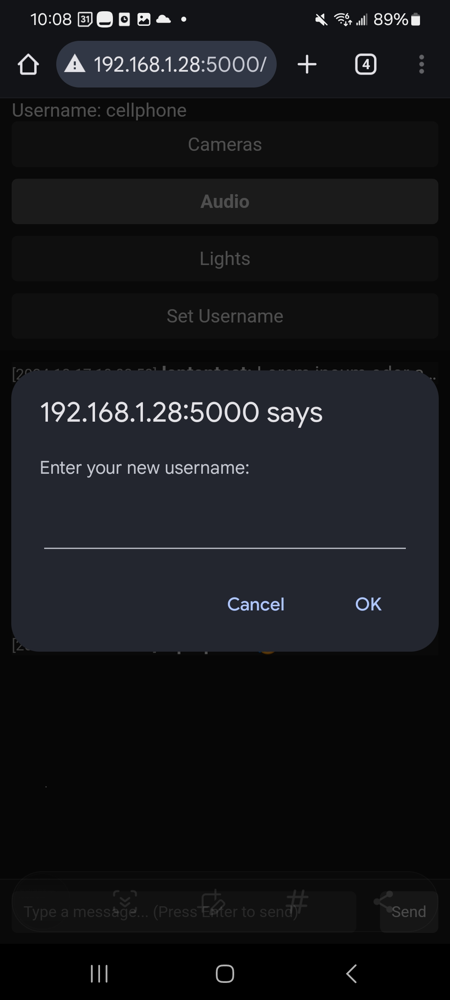

### Emoji Picker
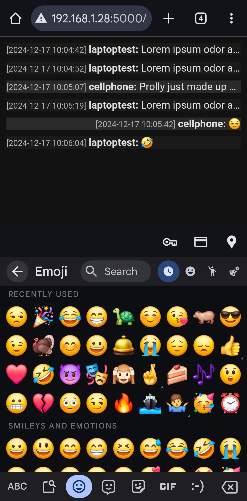

### Keyboard
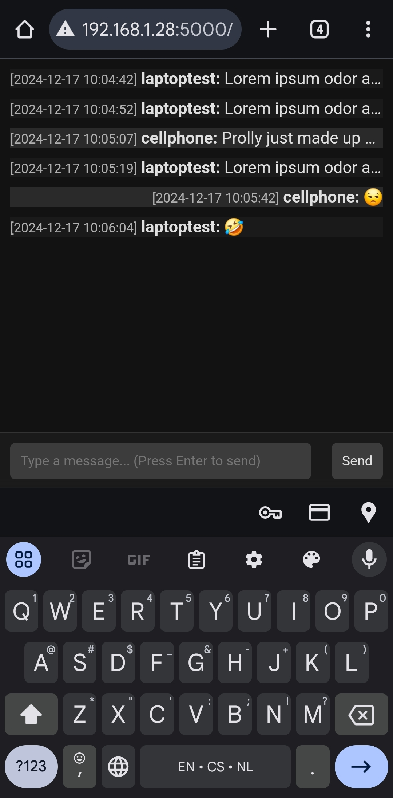

### Overflow Menu
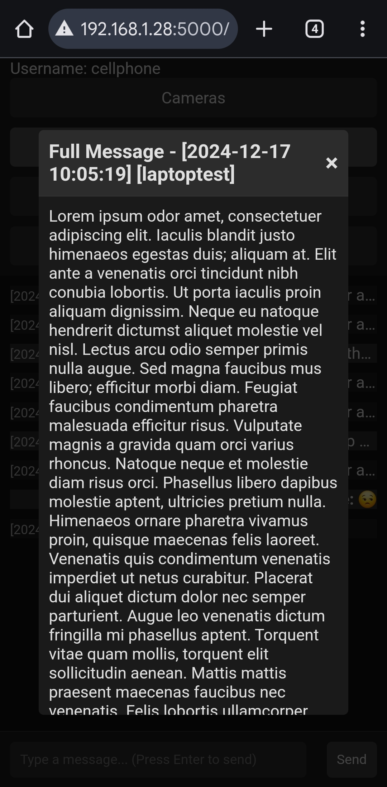
